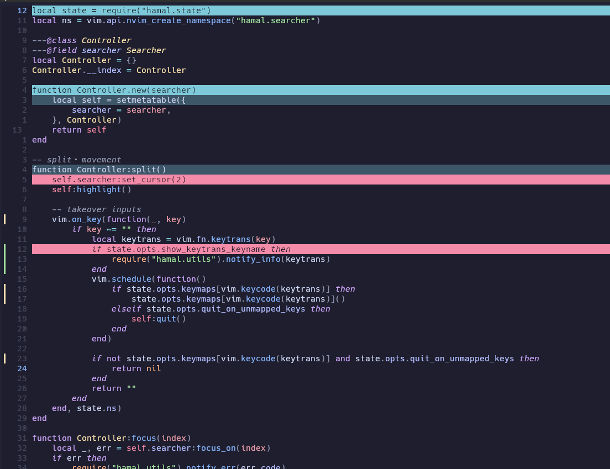

# hamal.nvim

> Fast and intuitive line navigation for Neovim.


`hamal.nvim` recursively divides the current window, letting you reach any visible line with only a few keystrokes.

Instead of typing a line number or repeatedly pressing `j`/`k`, simply choose the region containing your destination until you get there.

## Features

- ⚡️ Fast visual line navigation
- ⚙️ Configurable number of divisions
- 🖊️ Customizable keymaps and highlights
- ⏱️ Lightweight
- 🐱 No dependencies

## Why?

With **3 divisions**, navigating within a 100-line window takes at most **5 keypresses**.

| Divisions | Max keypresses (100 lines) |
| --------: | -------------------------: |
|         2 |                          7 |
|         3 |                          5 |
|         4 |                          4 |
|         5 |                          3 |

The required keypresses are approximately:

```
ceil(logₙ(lines))
```

where `n` is the number of divisions.

## Usage

A minimal usage example is as follows.

```lua
{
    "ergodice/hamal.nvim"
    config = function()
        local hamal = require("hamal")

        -- keymaps
        vim.keymap.set("n", "<leader><leader>", hamal.split)
        -- you can also use hamal in visual mode
        -- vim.keymap.set("v", "<leader><leader>", hamal.split) 

        -- You must call hamal.setup() at least once.
        hamal.setup({})
    end,
}
```

Please note that `split` should be defined outside of `opt.keymaps` in the `setup` argument.

## Configuration

```lua
{
    -- default configuration
    quit_on_unmapped_keys = true,
    divisions = 3,
    keymaps = {
        ["q"] = function()
            require("hamal").quit()
        end,
        ["H"] = function()
            require("hamal").focus(1)
        end,
        ["M"] = function()
            require("hamal").focus(2)
        end,
        ["L"] = function()
            require("hamal").focus(3)
        end,

        ["h"] = function()
            require("hamal").top()
        end,
        ["m"] = function()
            require("hamal").middle()
        end,
        ["l"] = function()
            require("hamal").bottom()
        end,

        ["<Esc>"] = function()
            require("hamal").pan_focus()
        end,
    },
    highlights = {
        { "HamalTop", { link = "IncSearch" } },
        { "HamalMid", { link = "Search" } },
        { "HamalBot", { link = "CurSearch" } },
    },
})
```

## Public API

| Function | Description |
|----------|-------------|
| `split()` | Enter hamal mode by dividing the current window. Usually mapped to a key outside of `setup()`. |
| `focus(index)` | Focus the `index`-th region of the current split (1 <= index <= divisions). |
| `pan_focus()` | Focus the parent region (the previous split level). |
| `top()` | Jump to the first line of the current region and exit hamal mode. |
| `middle()` | Jump to the middle line of the current region and exit hamal mode. |
| `bottom()` | Jump to the last line of the current region and exit hamal mode. |
| `quit()` | Exit hamal mode without moving the cursor. |
